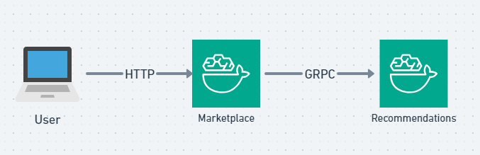

# python-microservices-grpc

## Use case: Example Microservices

To keep things manageable, you’ll define only two microservices:

Marketplace will be a very minimal web app that displays a list of books to the user.
Recommendations will be a microservice that provides a list of books in which the user may be interested.
Here’s a diagram that shows how your user interacts with the microservices:



You can see that the user will interact with the Marketplace microservice via their browser, and the Marketplace microservice will interact with the Recommendations microservice.

Think for a moment about the Recommendations API. You want the recommendations request to have a few features:

- User ID: You could use this to personalize the recommendations. However, for simplicity, all recommendations in this tutorial will be random.
- Book category: To make the API a little more interesting, you’ll add book categories, such as mystery, self-help, and so on.
- Max results: You don’t want to return every book in stock, so you’ll add a limit to the request.

The response will be a list of books. Each book will have the following data:

- Book ID: A unique numeric ID for the book.
- Book title: The title you can display to the user.
  A real website would have more data, but you’ll keep the number of features limited for the sake of this example.

## Coding

- Define the API with `protobufs/recommendations.proto`
- Generate the python code using `grpcio-tools`. This will be done in docker build stage.
- Write necessary code for the user to interact with browser.

## Run the application

```sh
docker compose build
docker compose up -d
```

Open application dashboard at [localhost](http://127.0.0.1:5000).

## Run integration tests

```sh
docker compose exec marketplace pytest marketplace_integration_test.py
```

## Stop and remove container

```sh
docker compose down
```

## Reference

- [The Python Tutorial](https://docs.python.org/3/tutorial/index.html)
- [Python packages](https://pypi.org)
